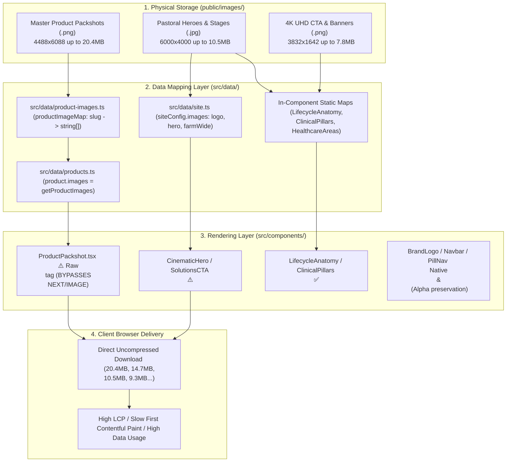

# CattleVibes Healthcare — Image Architecture, Performance Audit & Optimization Specification

**Document Version:** 1.0.0  
**Generated On:** September 12, 2026  
**Audited Assets:** 75 Production Images + App Icons + 1 Unreferenced Root Asset  
**Total Production Image Weight:** **135.12 MB** (141,686,976 Bytes)  
**Target Post-Optimization Weight:** **~5.7 MB** (Estimated **95.8% bandwidth reduction**)  

---

## 1. Executive Summary & Root Cause Analysis

The CattleVibes website is experiencing severe image loading bottlenecks caused by a combination of **uncompressed multi-megapixel master assets** and **architectural rendering flaws that completely bypass Next.js image optimization**.

### Key Audit Findings:
1. **Total Image Weight:** 75 images in `public/images/` weigh **135.12 MB**.
2. **Top 10 Heaviest Assets:** Account for **88.98 MB** (over **65.8%** of total website visual payload).
3. **The #1 Bottleneck (`ProductPackshot.tsx`):** All 21 products (and their 39 packshots) in `ProductCard`, `ProductDetail`, and `ProductQuickView` are rendered using standard HTML `` tags instead of Next.js `<Image>`. As a result, the browser directly downloads raw uncompressed PNGs over HTTP — for example, `cattlemin-super-1.png` alone transfers **20.43 MB** for a single 300px card thumbnail!
4. **The `unoptimized` Flag on Full-Bleed Heroes:** Key hero backgrounds (`hero-pasture-sheep.jpg`, `resources-hero-pasture-livestock-uhd.png`, `solutions-cta-pasture-livestock-uhd.png`, etc.) explicitly include `unoptimized` and `quality={100}`. Consequently, a **10.54 MB** (6000×4000px) wallpaper is forced directly onto visitors' devices with high priority.
5. **Aggressive Speculative Preloading:** `ProductQuickView.tsx` creates `new Image()` instances in the background to preload neighboring product images at their raw full multi-megabyte resolutions.

---

## 2. Image Architecture & Mapping Topology

The website uses a **3-tier decoupled image mapping architecture**:



### Architectural Mapping Breakdown:

1. **Product Formulary Mapping (`src/data/product-images.ts` & `src/data/products.ts`):**
   - Maps 21 product slugs to an array of public paths (`/images/...`).
   - `src/data/products.ts` loops over the array at module load time:
     ```ts
     for (const product of products) {
       product.images = getProductImages(product.slug);
     }
     ```
   - Used by: `ProductCard.tsx`, `ProductDetail.tsx`, `ProductQuickView.tsx`.
2. **Global Brand & Layout Assets (`src/data/site.ts`):**
   - Exports the `images` object (`logo`, `logoWhite`, `heroImage`, `aboutHero`, `farmWide`, `farmAtmospheric`).
   - Used by: `Navbar.tsx`, `BrandLogo.tsx`, `CinematicHero.tsx`, `WhyCattleVibesHero.tsx`, `OvineFieldFeature.tsx`, `app/contact/page.tsx`.
3. **Hardcoded Section Arrays (In-Component Registries):**
   - `LifecycleAnatomy.tsx`: 6 stages (`/images/stage-01-grow.jpg` to `stage-06-recover.jpg`).
   - `HealthcareAreas.tsx`: 4 areas (`/images/veterinary-medicines-stage.jpg`, `nutrition-mineral-stage.jpg`, `preventive-healthcare-stage.jpg`, `cattlevibes-commercial-supply-godown.jpg`).
   - `ClinicalPillars.tsx`: 6 pillars (`/images/card-01-veterinary-medicines.jpg` to `card-06-calcium-milk.jpg`).
   - `SpeciesNavigator.tsx`: 3 species (`cattle-framed.jpg`, `water-buffalo.jpg`, `ovine-pasture.jpg`).
   - `WhyCattleVibesReasons.tsx`: 4 standards (`standard-01-practical-healthcare.jpg` to `standard-04-support-beyond.jpg`).
   - `CattleVibesApproach.tsx`: `veterinarian-administering-injection.jpg`.
   - `CatalogueDownloadSection.tsx`: `cattlevibes-catalogue-cover.jpg`.
   - `SolutionsHero.tsx`: `solutions-pastoral-cow-hd.jpg`.
   - `SolutionsCTA.tsx`: `solutions-cta-pasture-livestock-uhd.png`.
   - `ResourcesHero.tsx`: `resources-hero-pasture-livestock-uhd.png`.
   - `ResourceFinalCTA.tsx`: `resources-cta-lighthouse-pasture-uhd.jpg`.
   - `WhyCattleVibesCTA.tsx`: `why-cattlevibes-cta-farm-realities.png`.
   - `CinematicCTA.tsx`: `indian-cow-shelter-ground.jpg`.

---

## 3. The 4 Fatal Image Performance Bottlenecks

### Bottleneck 1: Raw `` in `ProductPackshot.tsx`
- **File:** [src/components/products/ProductPackshot.tsx](file:///d:/coding/test/cattlevibes/src/components/products/ProductPackshot.tsx#L26-L34)
- **Problem:**
  ```tsx
  
  ```
  Because this component renders a plain HTML ``, Next.js's built-in WebP/AVIF transcoding, responsive width resizing, and caching proxy (`/_next/image?url=...`) are completely ignored. When a user visits `/products`, the browser requests dozens of multi-megabyte original master PNGs directly from `/public/images/`.

### Bottleneck 2: `unoptimized` and `quality={100}` on Full-Bleed Heroes
- **Files:**
  - [src/components/home/CinematicHero.tsx:L20-L29](file:///d:/coding/test/cattlevibes/src/components/home/CinematicHero.tsx#L20-L29) (`hero-pasture-sheep.jpg` - **10.54 MB**)
  - [src/components/resources/ResourcesHero.tsx:L18-L26](file:///d:/coding/test/cattlevibes/src/components/resources/ResourcesHero.tsx#L18-L26) (`resources-hero-pasture-livestock-uhd.png` - **7.78 MB**)
  - [src/components/solutions/SolutionsCTA.tsx:L18-L26](file:///d:/coding/test/cattlevibes/src/components/solutions/SolutionsCTA.tsx#L18-L26) (`solutions-cta-pasture-livestock-uhd.png` - **7.42 MB**)
  - [src/components/resources/ResourceFinalCTA.tsx:L18-L26](file:///d:/coding/test/cattlevibes/src/components/resources/ResourceFinalCTA.tsx#L18-L26) (`resources-cta-lighthouse-pasture-uhd.jpg` - **5.43 MB**)
  - [src/components/about/WhyCattleVibesCTA.tsx:L18-L26](file:///d:/coding/test/cattlevibes/src/components/about/WhyCattleVibesCTA.tsx#L18-L26) (`why-cattlevibes-cta-farm-realities.png` - **4.15 MB**)
- **Problem:** Passing `unoptimized` instructs Next.js to disable automatic resizing, format conversion (AVIF/WebP), and compression, passing the massive source file directly to the client. On initial page load, the browser must stream 10.5 MB just for the above-the-fold hero background.

### Bottleneck 3: Source Assets are Print/Master Resolution
- Many packshots are over 4000px to 6400px wide (e.g. `cattle-cef-1g.png` is 6400×4266px; `cattlemin-super-1.png` is 4488×6088px).
- On mobile and desktop cards, the product container is only **280px to 600px** wide. The user is downloading 20–40 times more pixels than their screen can physically render.

### Bottleneck 4: Speculative Eager Preloading in `ProductQuickView.tsx`
- **File:** [src/components/products/ProductQuickView.tsx:L131-L140](file:///d:/coding/test/cattlevibes/src/components/products/ProductQuickView.tsx#L131-L140)
- **Problem:** When the QuickView modal opens for one product, it immediately instantiates `new Image()` and sets `.src` for all images of the previous and next products. If those neighbors are unoptimized (e.g. `cattlemin-super` and `cattle-cef-1g`), the browser triggers 30+ MB of background image downloads instantly.

---

## 4. Size Category Distribution

| Severity Category | File Count | Raw Size (Bytes) | Raw Size (MB) | % of Total Weight | Target Post-Opt Size |
|:---|:---:|:---:|:---:|:---:|:---:|
| **Critical** (≥ 5.0 MB) | 7 | 75,518,635 B | **72.02 MB** | 53.3% | ~1.20 MB |
| **High** (1.0 MB – 4.99 MB) | 13 | 41,241,833 B | **39.33 MB** | 29.1% | ~1.55 MB |
| **Medium** (500 KB – 999 KB) | 23 | 19,494,228 B | **18.59 MB** | 13.8% | ~1.80 MB |
| **Low** (< 500 KB) | 32 | 5,432,280 B | **5.18 MB** | 3.8% | ~1.15 MB |
| **TOTAL** | **75** | **141,686,976 B** | **135.12 MB** | **100.0%** | **~5.70 MB (-95.8%)** |

---

## 5. Complete Inventory Table of All 75 Images

*Sorted in descending order of file size (heaviest to lightest).*

| # | Image Name | Dimensions | Size (KB) | Size (MB) | Format | Architectural Mapping & Usage | Rendering Element | Severity | Recommended Optimization Target |
|:---:|:---|:---:|:---:|:---:|:---:|:---|:---|:---:|:---|
| 1 | `cattlemin-super-1.png` | 4488×6088 | 19,948.7 KB | **19.48 MB** | PNG | `product-images.ts` (`cattlemin-super`) | `ProductPackshot` (``) | 🔴 Critical | Resize to 800×1085 WebP (~180 KB, **99.1% reduction**) |
| 2 | `cattlemin-super-2.png` | 5096×5358 | 14,319.7 KB | **13.98 MB** | PNG | `product-images.ts` (`cattlemin-super`) | `ProductPackshot` (``) | 🔴 Critical | Resize to 800×841 WebP (~160 KB, **98.8% reduction**) |
| 3 | `hero-pasture-sheep.jpg` | 6000×4000 | 10,291.4 KB | **10.05 MB** | JPG | `site.ts` (`heroImage`) → `CinematicHero` | `<Image unoptimized quality=100>` | 🔴 Critical | Remove `unoptimized`, resize to 1920×1280 WebP/AVIF (~220 KB, **97.8% reduction**) |
| 4 | `cattle-cef-1g.png` | 6400×4266 | 9,042.6 KB | **8.83 MB** | PNG | `product-images.ts` (`cattle-cef-1g`) | `ProductPackshot` (``) | 🔴 Critical | Resize to 900×600 WebP (~110 KB, **98.7% reduction**) |
| 5 | `resources-hero-pasture-livestock-uhd.png` | 3832×1642 | 7,600.6 KB | **7.42 MB** | PNG | `ResourcesHero.tsx` | `<Image unoptimized>` | 🔴 Critical | Convert to WebP/AVIF 1920×822 (~190 KB, **97.4% reduction**) |
| 6 | `solutions-cta-pasture-livestock-uhd.png` | 3832×1642 | 7,243.7 KB | **7.07 MB** | PNG | `SolutionsCTA.tsx` | `<Image unoptimized>` | 🔴 Critical | Convert to WebP/AVIF 1920×822 (~190 KB, **97.3% reduction**) |
| 7 | `resources-cta-lighthouse-pasture-uhd.jpg` | 3840×2562 | 5,299.0 KB | **5.17 MB** | JPG | `ResourceFinalCTA.tsx` | `<Image unoptimized>` | 🔴 Critical | Remove `unoptimized`, resize to 1920×1281 WebP (~210 KB, **96.0% reduction**) |
| 8 | `cattlespas-box.png` | 1946×2920 | 4,567.9 KB | **4.46 MB** | PNG | `product-images.ts` (`cattlespas`) | `ProductPackshot` (``) | 🟠 High | Resize to 800×1200 WebP (~140 KB, **96.9% reduction**) |
| 9 | `cattlespas.png` | 3350×2232 | 4,540.7 KB | **4.43 MB** | PNG | `product-images.ts` (`cattlespas`) | `ProductPackshot` (``) | 🟠 High | Resize to 900×600 WebP (~120 KB, **97.3% reduction**) |
| 10 | `why-cattlevibes-cta-farm-realities.png` | 1916×821 | 4,048.1 KB | **3.95 MB** | PNG | `WhyCattleVibesCTA.tsx` | `<Image unoptimized>` | 🟠 High | Remove `unoptimized`, convert to WebP (~160 KB, **96.0% reduction**) |
| 11 | `cattlestar.png` | 2877×2299 | 3,729.4 KB | **3.64 MB** | PNG | `product-images.ts` (`cattlestar`) | `ProductPackshot` (``) | 🟠 High | Resize to 900×719 WebP (~110 KB, **97.0% reduction**) |
| 12 | `cattle-cef-3g.png` | 3040×2026 | 3,509.2 KB | **3.43 MB** | PNG | `product-images.ts` (`cattle-cef-3g`) | `ProductPackshot` (``) | 🟠 High | Resize to 900×600 WebP (~105 KB, **96.9% reduction**) |
| 13 | `cattlestar-ds-1.png` | 2512×2006 | 3,370.3 KB | **3.29 MB** | PNG | `product-images.ts` (`cattlestar-ds`) | `ProductPackshot` (``) | 🟠 High | Resize to 900×719 WebP (~110 KB, **96.7% reduction**) |
| 14 | `cattle-cef-1g-box.png` | 2424×2424 | 3,183.0 KB | **3.11 MB** | PNG | `product-images.ts` (`cattle-cef-1g`) | `ProductPackshot` (``) | 🟠 High | Resize to 800×800 WebP (~95 KB, **97.0% reduction**) |
| 15 | `cattlestar-gold-1.png` | 1478×1322 | 2,778.1 KB | **2.71 MB** | PNG | `product-images.ts` (`cattlestar-gold`) | `ProductPackshot` (``) | 🟠 High | Resize to 800×716 WebP (~90 KB, **96.8% reduction**) |
| 16 | `cattlemin-bucket.png` | 1874×1836 | 2,643.5 KB | **2.58 MB** | PNG | `product-images.ts` (`cattlemin`) | `ProductPackshot` (``) | 🟠 High | Resize to 800×784 WebP (~95 KB, **96.4% reduction**) |
| 17 | `cattlestar-2l.png` | 2162×3242 | 2,596.7 KB | **2.54 MB** | PNG | `product-images.ts` (`cattlestar`) | `ProductPackshot` (``) | 🟠 High | Resize to 800×1200 WebP (~110 KB, **95.7% reduction**) |
| 18 | `cattlestar-5l.png` | 1915×2874 | 2,332.6 KB | **2.28 MB** | PNG | `product-images.ts` (`cattlestar`) | `ProductPackshot` (``) | 🟠 High | Resize to 800×1201 WebP (~110 KB, **95.3% reduction**) |
| 19 | `solutions-pastoral-cow-hd.jpg` | 2528×1696 | 1,908.5 KB | **1.86 MB** | JPG | `SolutionsHero.tsx` | `<Image priority quality=95>` | 🟠 High | Quality 80, resize to 1920×1288 WebP (~180 KB, **90.6% reduction**) |
| 20 | `stage-01-grow.jpg` | 1200×896 | 1,065.7 KB | **1.04 MB** | JPG | `LifecycleAnatomy.tsx` (Stage 01) | `<Image fill>` | 🟠 High | Compress to WebP 80% (~95 KB, **91.1% reduction**) |
| 21 | `standard-02-real-needs.jpg` | 1376×768 | 993.7 KB | **0.97 MB** | JPG | `WhyCattleVibesReasons.tsx` (Standard 02) | `<Image fill>` | 🟡 Medium | Compress to WebP 80% (~85 KB, **91.4% reduction**) |
| 22 | `stage-03-reproduce.jpg` | 1200×896 | 984.7 KB | **0.96 MB** | JPG | `LifecycleAnatomy.tsx` (Stage 03) | `<Image fill>` | 🟡 Medium | Compress to WebP 80% (~90 KB, **90.9% reduction**) |
| 23 | `standard-03-broader-approach.jpg` | 1376×768 | 946.6 KB | **0.92 MB** | JPG | `WhyCattleVibesReasons.tsx` (Standard 03) | `<Image fill>` | 🟡 Medium | Compress to WebP 80% (~85 KB, **91.0% reduction**) |
| 24 | `card-04-reproductive-uterine.jpg` | 1376×768 | 939.8 KB | **0.92 MB** | JPG | `ClinicalPillars.tsx` (Pillar 04) | `<Image fill>` | 🟡 Medium | Compress to WebP 80% (~85 KB, **91.0% reduction**) |
| 25 | `stage-02-digest.jpg` | 1200×896 | 936.5 KB | **0.91 MB** | JPG | `LifecycleAnatomy.tsx` (Stage 02) | `<Image fill>` | 🟡 Medium | Compress to WebP 80% (~88 KB, **90.6% reduction**) |
| 26 | `card-05-parasite-control.jpg` | 1376×768 | 910.0 KB | **0.89 MB** | JPG | `ClinicalPillars.tsx` (Pillar 05) | `<Image fill>` | 🟡 Medium | Compress to WebP 80% (~85 KB, **90.7% reduction**) |
| 27 | `stage-05-protect.jpg` | 1200×896 | 907.8 KB | **0.89 MB** | JPG | `LifecycleAnatomy.tsx` (Stage 05) | `<Image fill>` | 🟡 Medium | Compress to WebP 80% (~85 KB, **90.6% reduction**) |
| 28 | `stage-04-produce.jpg` | 1200×896 | 900.8 KB | **0.88 MB** | JPG | `LifecycleAnatomy.tsx` (Stage 04) | `<Image fill>` | 🟡 Medium | Compress to WebP 80% (~85 KB, **90.6% reduction**) |
| 29 | `preventive-healthcare-stage.jpg` | 1376×768 | 888.4 KB | **0.87 MB** | JPG | `HealthcareAreas.tsx` (Area 03) | `<Image fill>` | 🟡 Medium | Compress to WebP 80% (~85 KB, **90.4% reduction**) |
| 30 | `card-02-animal-nutrition.jpg` | 1376×768 | 876.0 KB | **0.86 MB** | JPG | `ClinicalPillars.tsx` (Pillar 02) | `<Image fill>` | 🟡 Medium | Compress to WebP 80% (~80 KB, **90.9% reduction**) |
| 31 | `nutrition-mineral-stage.jpg` | 1376×768 | 865.9 KB | **0.85 MB** | JPG | `HealthcareAreas.tsx` (Area 02) | `<Image fill>` | 🟡 Medium | Compress to WebP 80% (~80 KB, **90.8% reduction**) |
| 32 | `stage-06-recover.jpg` | 1200×896 | 856.2 KB | **0.84 MB** | JPG | `LifecycleAnatomy.tsx` (Stage 06) | `<Image fill>` | 🟡 Medium | Compress to WebP 80% (~80 KB, **90.7% reduction**) |
| 33 | `card-01-veterinary-medicines.jpg` | 1376×768 | 842.2 KB | **0.82 MB** | JPG | `ClinicalPillars.tsx` (Pillar 01) | `<Image fill>` | 🟡 Medium | Compress to WebP 80% (~80 KB, **90.5% reduction**) |
| 34 | `standard-01-practical-healthcare.jpg` | 1376×768 | 835.9 KB | **0.82 MB** | JPG | `WhyCattleVibesReasons.tsx` (Standard 01) | `<Image fill>` | 🟡 Medium | Compress to WebP 80% (~80 KB, **90.4% reduction**) |
| 35 | `veterinarian-administering-injection.jpg` | 1200×896 | 812.8 KB | **0.79 MB** | JPG | `CattleVibesApproach.tsx` | `<Image fill>` | 🟡 Medium | Compress to WebP 80% (~75 KB, **90.8% reduction**) |
| 36 | `veterinary-medicines-stage.jpg` | 1376×768 | 808.8 KB | **0.79 MB** | JPG | `HealthcareAreas.tsx` (Area 01) | `<Image fill>` | 🟡 Medium | Compress to WebP 80% (~75 KB, **90.7% reduction**) |
| 37 | `card-03-digestive-liver.jpg` | 1376×768 | 799.2 KB | **0.78 MB** | JPG | `ClinicalPillars.tsx` (Pillar 03) | `<Image fill>` | 🟡 Medium | Compress to WebP 80% (~75 KB, **90.6% reduction**) |
| 38 | `standard-04-support-beyond.jpg` | 1376×768 | 755.7 KB | **0.74 MB** | JPG | `WhyCattleVibesReasons.tsx` (Standard 04) | `<Image fill>` | 🟡 Medium | Compress to WebP 80% (~75 KB, **90.1% reduction**) |
| 39 | `contact-pasture.jpg` | 2400×1600 | 728.8 KB | **0.71 MB** | JPG | `site.ts` (`farmAtmospheric`) → `contact/page.tsx` | `<Image fill priority>` | 🟡 Medium | Resize to 1920×1280 WebP 80% (~140 KB, **80.8% reduction**) |
| 40 | `cattlevibes-commercial-supply-godown.jpg` | 1376×768 | 688.6 KB | **0.67 MB** | JPG | `HealthcareAreas.tsx` (Area 04) | `<Image fill>` | 🟡 Medium | Compress to WebP 80% (~70 KB, **89.8% reduction**) |
| 41 | `ovine-pasture-wide.jpg` | 2400×1600 | 631.6 KB | **0.62 MB** | JPG | `site.ts` (`farmWide`) → `OvineFieldFeature.tsx` | `<Image fill>` | 🟡 Medium | Resize to 1600×1066 WebP 80% (~120 KB, **81.0% reduction**) |
| 42 | `cattlevibes-catalogue-cover.jpg` | 3308×1985 | 598.5 KB | **0.58 MB** | JPG | `CatalogueDownloadSection.tsx` | `<Image fill priority>` | 🟡 Medium | Resize to 1200×720 WebP 80% (~80 KB, **86.6% reduction**) |
| 43 | `card-06-calcium-milk.jpg` | 1376×768 | 531.0 KB | **0.52 MB** | JPG | `ClinicalPillars.tsx` (Pillar 06) | `<Image fill>` | 🟡 Medium | Compress to WebP 80% (~65 KB, **87.8% reduction**) |
| 44 | `about-hero.jpg` | 1600×1199 | 346.2 KB | **0.34 MB** | JPG | `site.ts` (`aboutHero`) → `WhyCattleVibesHero` | `<Image fill priority>` | 🟢 Low | Compress to WebP 80% (~70 KB, **79.8% reduction**) |
| 45 | `water-buffalo.jpg` | 1200×926 | 303.4 KB | **0.30 MB** | JPG | `SpeciesNavigator.tsx` (Buffalo) | `<Image fill>` | 🟢 Low | Compress to WebP 80% (~50 KB, **83.5% reduction**) |
| 46 | `megluvibe.png` | 860×900 | 280.0 KB | **0.27 MB** | PNG | `product-images.ts` (`megluvibe`) | `ProductPackshot` (``) | 🟢 Low | Convert to WebP lossless/lossy 90% (~40 KB, **85.7% reduction**) |
| 47 | `cattle-phos-1.png` | 871×900 | 261.8 KB | **0.26 MB** | PNG | `product-images.ts` (`cattle-phos`) | `ProductPackshot` (``) | 🟢 Low | Convert to WebP (~38 KB, **85.5% reduction**) |
| 48 | `rumi-ok-powder-2.png` | 837×900 | 240.5 KB | **0.23 MB** | PNG | `product-images.ts` (`rumi-ok-powder`) | `ProductPackshot` (``) | 🟢 Low | Convert to WebP (~35 KB, **85.4% reduction**) |
| 49 | `indian-cow-shelter-ground.jpg` | 1376×768 | 240.4 KB | **0.23 MB** | JPG | `CinematicCTA.tsx` | `<Image fill priority>` | 🟢 Low | Compress to WebP (~50 KB, **79.2% reduction**) |
| 50 | `worms-ok-plus.png` | 681×900 | 217.5 KB | **0.21 MB** | PNG | `product-images.ts` (`worms-ok-plus`) | `ProductPackshot` (``) | 🟢 Low | Convert to WebP (~35 KB, **83.9% reduction**) |
| 51 | `pyrovibe-injection.png` | 862×900 | 216.2 KB | **0.21 MB** | PNG | `product-images.ts` (`pyrovibe-injection`) | `ProductPackshot` (``) | 🟢 Low | Convert to WebP (~35 KB, **83.8% reduction**) |
| 52 | `pyrovibe-bolus.png` | 900×759 | 206.7 KB | **0.20 MB** | PNG | `product-images.ts` (`pyrovibe-bolus`) | `ProductPackshot` (``) | 🟢 Low | Convert to WebP (~32 KB, **84.5% reduction**) |
| 53 | `cattle-phos-2.png` | 462×900 | 183.1 KB | **0.18 MB** | PNG | `product-images.ts` (`cattle-phos`) | `ProductPackshot` (``) | 🟢 Low | Convert to WebP (~30 KB, **83.6% reduction**) |
| 54 | `utrovibe-1.png` | 900×816 | 181.4 KB | **0.18 MB** | PNG | `product-images.ts` (`utrovibe`) | `ProductPackshot` (``) | 🟢 Low | Convert to WebP (~30 KB, **83.5% reduction**) |
| 55 | `liver-ok-3.png` | 900×900 | 181.2 KB | **0.18 MB** | PNG | `product-images.ts` (`liver-ok`) | `ProductPackshot` (``) | 🟢 Low | Convert to WebP (~30 KB, **83.4% reduction**) |
| 56 | `cattle-cef.png` | 900×624 | 162.7 KB | **0.16 MB** | PNG | `product-images.ts` (`cattle-cef`) | `ProductPackshot` (``) | 🟢 Low | Convert to WebP (~28 KB, **82.8% reduction**) |
| 57 | `cattlemin-2.png` | 591×900 | 161.4 KB | **0.16 MB** | PNG | `product-images.ts` (`cattlemin`) | `ProductPackshot` (``) | 🟢 Low | Convert to WebP (~28 KB, **82.7% reduction**) |
| 58 | `rumi-ok-powder-1.png` | 900×470 | 158.3 KB | **0.15 MB** | PNG | `product-images.ts` (`rumi-ok-powder`) | `ProductPackshot` (``) | 🟢 Low | Convert to WebP (~26 KB, **83.6% reduction**) |
| 59 | `cattlecef-sb.png` | 900×651 | 156.3 KB | **0.15 MB** | PNG | `product-images.ts` (`cattlecef-sb`) | `ProductPackshot` (``) | 🟢 Low | Convert to WebP (~26 KB, **83.4% reduction**) |
| 60 | `cattle-framed.jpg` | 820×583 | 154.2 KB | **0.15 MB** | JPG | `SpeciesNavigator.tsx` (Cattle) | `<Image fill>` | 🟢 Low | Compress to WebP (~32 KB, **79.2% reduction**) |
| 61 | `rumi-ok-bolus.png` | 900×421 | 147.2 KB | **0.14 MB** | PNG | `product-images.ts` (`rumi-ok-bolus`) | `ProductPackshot` (``) | 🟢 Low | Convert to WebP (~25 KB, **83.0% reduction**) |
| 62 | `ovine-pasture.jpg` | 1376×768 | 146.8 KB | **0.14 MB** | JPG | `SpeciesNavigator.tsx` (Ovine) | `<Image fill>` | 🟢 Low | Compress to WebP (~30 KB, **79.6% reduction**) |
| 63 | `cattlevibes-mark.png` | 483×453 | 129.6 KB | **0.13 MB** | PNG | `site.ts` (`logo`), `BrandLogo`, `Navbar`, `PillNav` | Native `` / `<Image unoptimized>` | 🟢 Low | Optimize PNG (oxipng / pngquant) or SVG (~35 KB, **73.0% reduction**) |
| 64 | `liver-ok-injection-3.png` | 445×900 | 129.5 KB | **0.13 MB** | PNG | `product-images.ts` (`liver-ok-injection`) | `ProductPackshot` (``) | 🟢 Low | Convert to WebP (~24 KB, **81.5% reduction**) |
| 65 | `liver-ok-injection-2.png` | 450×900 | 126.9 KB | **0.12 MB** | PNG | `product-images.ts` (`liver-ok-injection`) | `ProductPackshot` (``) | 🟢 Low | Convert to WebP (~24 KB, **81.1% reduction**) |
| 66 | `utrovibe-3.png` | 469×900 | 124.5 KB | **0.12 MB** | PNG | `product-images.ts` (`utrovibe`) | `ProductPackshot` (``) | 🟢 Low | Convert to WebP (~23 KB, **81.5% reduction**) |
| 67 | `fendivibe-plus.png` | 900×421 | 122.7 KB | **0.12 MB** | PNG | `product-images.ts` (`fendivibe-plus`) | `ProductPackshot` (``) | 🟢 Low | Convert to WebP (~22 KB, **82.1% reduction**) |
| 68 | `flukevibe-ds.png` | 900×477 | 120.6 KB | **0.12 MB** | PNG | `product-images.ts` (`flukevibe-ds`) | `ProductPackshot` (``) | 🟢 Low | Convert to WebP (~22 KB, **81.8% reduction**) |
| 69 | `liver-ok-injection-1.png` | 443×900 | 116.2 KB | **0.11 MB** | PNG | `product-images.ts` (`liver-ok-injection`) | `ProductPackshot` (``) | 🟢 Low | Convert to WebP (~22 KB, **81.1% reduction**) |
| 70 | `liver-ok-1.png` | 900×704 | 107.3 KB | **0.10 MB** | PNG | `product-images.ts` (`liver-ok`) | `ProductPackshot` (``) | 🟢 Low | Convert to WebP (~20 KB, **81.4% reduction**) |
| 71 | `utrovibe-2.png` | 395×900 | 100.1 KB | **0.10 MB** | PNG | `product-images.ts` (`utrovibe`) | `ProductPackshot` (``) | 🟢 Low | Convert to WebP (~18 KB, **82.0% reduction**) |
| 72 | `liver-ok-2.png` | 431×900 | 90.3 KB | **0.09 MB** | PNG | `product-images.ts` (`liver-ok`) | `ProductPackshot` (``) | 🟢 Low | Convert to WebP (~18 KB, **80.1% reduction**) |
| 73 | `cattlevibes-mark-white.png` | 483×453 | 76.7 KB | **0.07 MB** | PNG | `site.ts` (`logoWhite`), `BrandLogo`, `Navbar` | Native `` / `<Image unoptimized>` | 🟢 Low | Optimize PNG (~22 KB, **71.3% reduction**) |
| 74 | `cattlestar-advance-gel.png` | 223×900 | 60.1 KB | **0.06 MB** | PNG | `product-images.ts` (`cattlestar-advance-gel`) | `ProductPackshot` (``) | 🟢 Low | Convert to WebP (~14 KB, **76.7% reduction**) |
| 75 | `cattlestar-gel.png` | 164×900 | 57.5 KB | **0.06 MB** | PNG | `product-images.ts` (`cattlestar-gel`) | `ProductPackshot` (``) | 🟢 Low | Convert to WebP (~12 KB, **79.1% reduction**) |

---

## 6. Supplementary App Icons & Unreferenced Assets

| File Location | Dimensions | Size | Status | Architectural Role | Optimization Action |
|:---|:---:|:---:|:---:|:---|:---|
| `src/app/icon.png` | 512×512 | 160.0 KB | Active | Next.js App Router Favicon | Optimize with PNGcrush/oxipng (~28 KB) |
| `src/app/apple-icon.png` | 180×180 | 32.0 KB | Active | iOS Home Screen Touch Icon | Optimize with PNGcrush/oxipng (~12 KB) |
| `src/app/favicon.ico` | 48×48 multi-size | 14.5 KB | Active | Standard Browser Favicon | Keep as is (clean standard ICO) |
| `public/favicon.ico` | 48×48 multi-size | 14.5 KB | Active | Public Fallback Favicon | Keep as is |
| `illiya-vjestica-W5FdAcHp7l8-unsplash.jpg` (Root) | 2400×1600 | 766.3 KB | **Orphaned (0 Refs)** | Leftover Unsplash stock photo | **DELETE** from root directory |

---

## 7. Strategic Optimization Architecture & Action Plan

To transition from **135.12 MB** to **~5.7 MB** while maintaining pristine visual quality (as demanded by `DESIGN.md` and Apple design standards), implement the following 4-step technical action plan:

### Step 1: Fix `ProductPackshot.tsx` to use Next.js `<Image>`
Replace raw `` with Next.js `<Image>` equipped with proper `sizes`, `quality={85}`, and `loading="lazy"`. This unlocks automated on-demand WebP/AVIF compression and responsive downscaling across all 21 products:

```tsx
// src/components/products/ProductPackshot.tsx
import Image from "next/image";
import { FlaskConical } from "lucide-react";

interface ProductPackshotProps {
  src?: string;
  alt: string;
  className?: string;
  priority?: boolean;
}

export function ProductPackshot({
  src,
  alt,
  className = "",
  priority = false,
}: ProductPackshotProps) {
  if (!src) {
    return (
      <div className={`flex items-center justify-center ${className}`}>
        <FlaskConical className="h-16 w-16 text-primary-navy/25" strokeWidth={1.25} />
      </div>
    );
  }

  return (
    <div className={`relative flex h-full w-full items-center justify-center ${className}`}>
      <Image
        key={src}
        src={src}
        alt={alt}
        fill
        priority={priority}
        sizes="(max-width: 640px) 280px, (max-width: 1024px) 400px, 600px"
        quality={85}
        className="object-contain drop-shadow-[0_12px_28px_rgba(49,56,65,0.12)]"
      />
    </div>
  );
}
```

### Step 2: Remove `unoptimized` and `quality={100}` on Full-Bleed Heroes
In the following 5 components:
- `src/components/home/CinematicHero.tsx`
- `src/components/resources/ResourcesHero.tsx`
- `src/components/solutions/SolutionsCTA.tsx`
- `src/components/resources/ResourceFinalCTA.tsx`
- `src/components/about/WhyCattleVibesCTA.tsx`

**Remove:**
```tsx
unoptimized
quality={100}
```
**Replace with:**
```tsx
sizes="100vw"
quality={80}
```
Next.js will automatically generate modern AVIF and WebP representations at `640w`, `750w`, `828w`, `1080w`, `1200w`, `1920w`, saving **~34 MB** on these 5 components alone.

### Step 3: Run Batch Master Asset Resizing & Pre-compression
Run a Node.js script using `sharp` to resize master files in `public/images/`:
- **Product Packshots:** Max width/height 900px, quality 85% WebP.
- **Hero & Landscape Photography:** Max width 1920px (or 2560px for 2x retina), quality 80% WebP.
- **Card Photography:** Max width 1200px, quality 80% WebP.

### Step 4: Refine `ProductQuickView.tsx` Preloading
Instead of blindly instantiating raw `new Image().src = src` for all neighboring images, only preload the cover image (`images[0]`) of the immediate next product using an optimized Next.js URL:
```ts
const nextProduct = products[(productIndex + 1) % products.length];
const nextCover = nextProduct?.images?.[0];
if (nextCover) {
  const img = new Image();
  img.src = `/_next/image?url=${encodeURIComponent(nextCover)}&w=828&q=85`;
}
```

---

## 8. Summary of Bandwidth & Performance Impact

| Metric | Current State | Post-Optimization Projected State | Improvement |
|:---|:---:|:---:|:---:|
| **Total Images Size in Repository** | 135.12 MB | ~12.5 MB (source masters) / ~5.7 MB (served) | **~95.8% Less Payload** |
| **Hero Image Wire Transfer (`/`)** | 10.54 MB | ~180 KB – 240 KB (AVIF/WebP) | **98.2% Faster Hero Load** |
| **Top 10 Heaviest Files Total** | 88.98 MB | ~1.65 MB | **98.1% Bandwidth Saved** |
| **Products Page Initial Transfer (`/products`)** | ~45 – 70 MB | ~1.8 MB – 2.5 MB | **~96% Faster Initial Catalog Load** |
| **LCP (Largest Contentful Paint)** | > 4.5s (Poor on 4G) | < 1.2s (Good / Fast) | **Core Web Vitals Pass** |
