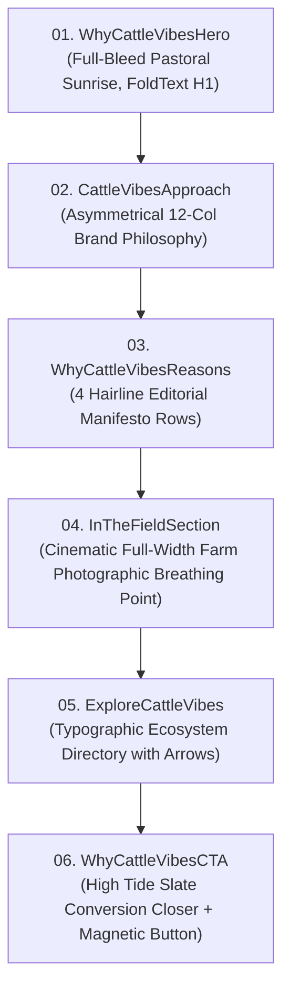

# Why CattleVibes — Complete Page Documentation & Content Specification

> **Document Purpose:** Complete architectural, content, layout, typography, and design documentation for the **Why CattleVibes** page (`/about`). This document serves as the master reference for future restructuring, layout refactoring, or visual redesign, ensuring that all verified veterinary medical claims, editorial hierarchy, and brand standards are preserved.

---

## 1. Page Metadata & Executive Overview

| Attribute | Specification |
| :--- | :--- |
| **Route Path** | `/about` |
| **Nav Label** | Why CattleVibes |
| **Page Title (`<title>`)** | `Why CattleVibes \| Complete Animal Healthcare Solutions` |
| **Meta Description** | `Why farms, veterinarians, and animal health professionals choose CattleVibes: practical veterinary medicines, clinical nutrition, and field-proven herd protocols.` |
| **Page Component** | [`src/app/about/page.tsx`](file:///d:/coding/test/cattlevibes/src/app/about/page.tsx) |
| **Primary Theme** | Editorial Veterinary Healthcare with Agricultural Authenticity |
| **Core Objective** | Answer concisely and authoritatively: *"Why should dairy farms, livestock producers, veterinarians, and commercial distributors partner with CattleVibes?"* |
| **Page Structure** | 6 sequential editorial sections with zero filler, generic SaaS cards, or invented statistics. |

---

## 2. Global Design System & Visual Tokens

### 2.1 Color Palette

| Token Name | HEX / Value | Role & Applied Context |
| :--- | :--- | :--- |
| **Deep Navy / High Tide** | `#313841` | Hero backdrop scrims, primary headlines, final CTA background, high-contrast dark sections. |
| **Yam Orange (Brand Accent)** | `#ea9216` | Editorial eyebrow tags, numbered callouts (`01`–`04`), primary conversion buttons, hover accents. |
| **Soft White / Pebble** | `#F6F3EC` (`bg-soft-white`) | Alternating editorial section backdrops (`CattleVibesApproach`, `ExploreCattleVibes`). |
| **Pure White** | `#ffffff` | Primary body background (`WhyCattleVibesReasons`), hero headline text, card surfaces. |
| **Cadet Blue** | `#3a4750` | Secondary editorial body copy, supporting paragraphs, technical explanations. |
| **Hairline Border** | `#e2e8f0` (`border-border`) | Strict 1px structural dividing rules separating editorial rows and columns. |
| **Glass Frosted White** | `rgba(255, 255, 255, 0.82)` | Quarter-circle corner logo badge backdrop with `backdrop-filter: blur(20px)`. |

### 2.2 Typography Scale

- **Heading Font:** `Manrope` (`var(--font-manrope)`), ExtraBold (`font-extrabold` / `800`) & Bold (`font-bold` / `700`).
- **Body Font:** `Inter` (`var(--font-inter)`), Medium (`font-medium` / `500`) & Regular (`400`).
- **Tracking / Letter Spacing:**
  - Eyebrows: `tracking-[0.2em]` (uppercase, 11px–12px, bold).
  - Main Display Headlines: `tracking-[-0.03em]` to `tracking-[-0.02em]`.
  - Section H2s: `tracking-tight` (`-0.015em`).
  - Body Copy: `tracking-[-0.01em]` to `normal`.
- **Leading / Line Height:**
  - Display Hero H1: `leading-[1.06]`.
  - Editorial H2s: `leading-[1.12]` to `leading-[1.15]`.
  - Body Copy: `leading-relaxed` (`1.625` to `1.75`).

### 2.3 Motion & Interaction Foundations (Apple Fluid Motion)

- **Standard Easing:** `cubic-bezier(0.16, 1, 0.3, 1)` (Apple fluid deceleration curve).
- **Fade & Rise:** `opacity: 0, y: 16px` transitioning to `opacity: 1, y: 0px` on viewport entry (`margin: -40px` to `-60px`).
- **FoldText Animation:** Applied to Hero headline with `hinge="top"`, `duration=0.7`, `stagger=0.035`, `creaseShading=0.45`.
- **Accessibility:** Mandatory `useReducedMotion()` hook across all animated components. When `prefers-reduced-motion: reduce` is active, all transforms and opacity shifts resolve immediately without transition delays.

### 2.4 Layout Grids & Container Rules

- **Maximum Width:** `max-w-[1800px]` centered (`mx-auto`).
- **Horizontal Viewport Padding:** `px-4 sm:px-6 lg:px-8`.
- **Section Vertical Rhythm:** `py-20 sm:py-24 lg:py-28` to `py-24 sm:py-28 lg:py-32`.
- **Separation:** Crisp hairline dividers (`border-t border-border` / `border-b border-border`).

---

## 3. Section-by-Section Content, Layout & Code Blueprint



---

### Section 01: Hero Section

- **Component File:** [`src/components/about/WhyCattleVibesHero.tsx`](file:///d:/coding/test/cattlevibes/src/components/about/WhyCattleVibesHero.tsx)
- **Role:** Cinematic, left-aligned art-directed hero introducing the core brand promise over an authentic pastoral landscape.
- **Background Asset:** `/images/about-hero.jpg` (Full bleed, `fill`, `sizes="100vw"`, `object-cover object-[center_60%] lg:object-[center_50%]`).
- **Container Sizing:** `relative flex min-h-screen min-h-[100svh] items-center overflow-hidden bg-deep-navy pt-24 pb-16 sm:pt-28 sm:pb-20 lg:pt-28 lg:pb-20`.
- **Scrim Overlay:**
  - Desktop directional scrim: `bg-gradient-to-r from-deep-navy/92 via-deep-navy/65 via-50% to-transparent lg:from-deep-navy/90 lg:via-deep-navy/52 lg:via-55% lg:to-transparent`.
  - Mobile bottom/top protection: `bg-gradient-to-t from-deep-navy/60 via-transparent to-deep-navy/20 lg:hidden`.

#### Exact Content & Copy:

```markdown
# [Headline - Line 1 (FoldText)]
Built Around Better

# [Headline - Line 2 (FoldText)]
Animal Healthcare.

# [Supporting Copy]
Precision veterinary medicines and clinical nutritional solutions engineered around daily farm realities and long-term herd productivity.
```

#### Formatting & Typography Hierarchy:
- **Headline (H1):** `font-heading text-[clamp(2.25rem,5.6vw,5.5rem)] font-extrabold leading-[1.06] tracking-[-0.03em] text-white`.
- **Supporting Copy (P):** `mt-6 sm:mt-7 max-w-2xl text-base sm:text-lg lg:text-[1.125rem] font-medium leading-relaxed tracking-[-0.01em] text-white/90 antialiased`.

#### Corner Glassmorphic Logo Anchor (Navbar Integration):
- Positioned at `fixed top-0 left-0 z-[105]` inside [`Navbar.tsx`](file:///d:/coding/test/cattlevibes/src/components/layout/Navbar.tsx).
- Exact dimensions: `width: var(--nav-height); height: var(--nav-height);`.
- Curvature: `border-bottom-right-radius: 100%` (exact circle quadrant).
- **Radius alignment rule:** Radius equals `var(--nav-height)`, exactly aligning with the bottom line of the navbar without hanging past it.
- Backdrop filter: `blur(20px) saturate(180%)` over `rgba(255, 255, 255, 0.82)`.

---

### Section 02: The CattleVibes Approach

- **Component File:** [`src/components/about/CattleVibesApproach.tsx`](file:///d:/coding/test/cattlevibes/src/components/about/CattleVibesApproach.tsx)
- **Role:** High-impact editorial brand statement articulating clinical philosophy.
- **Background & Spacing:** `bg-soft-white py-20 sm:py-24 lg:py-28 border-b border-border`.
- **Layout Architecture:** Asymmetrical 12-Column Grid (`lg:grid-cols-12 gap-10 lg:gap-16 items-center`).
  - **Left Block (7 cols):** Eyebrow + Primary Philosophical Proposition.
  - **Right Block (5 cols):** Vertical hairline rule divider (`lg:border-l lg:border-border lg:pl-12`) + Verified Supporting Copy + Tagline closer.

#### Exact Content & Copy:

```markdown
# [Eyebrow]
THE CATTLE VIBES APPROACH

# [Primary Statement (H2)]
Veterinary healthcare engineered around physiological stress windows, metabolic recovery, and daily farm productivity.

# [Supporting Description (P)]
CattleVibes brings together targeted therapeutics, reproductive tonics, and bio-active nutritional supplements to protect livestock vitality and agricultural welfare under qualified veterinary guidance.

# [Tagline]
COMPLETE ANIMAL HEALTHCARE SOLUTIONS
```

#### Formatting & Typography Hierarchy:
- **Eyebrow:** `text-xs font-extrabold tracking-[0.2em] uppercase text-[#ea9216]` paired with a decorative rule (`h-px w-5 bg-[#ea9216]`).
- **Primary Statement (H2):** `font-heading text-2xl sm:text-3xl md:text-4xl lg:text-[2.65rem] font-extrabold tracking-tight text-deep-navy leading-[1.15]`.
- **Supporting Description (P):** `font-body text-base sm:text-lg leading-relaxed text-cadet-blue`.
- **Tagline:** `font-heading text-sm font-bold text-deep-navy tracking-wide uppercase pt-5 border-t border-border/80`.

---

### Section 03: Four Foundational Standards (Manifesto Rows)

- **Component File:** [`src/components/about/WhyCattleVibesReasons.tsx`](file:///d:/coding/test/cattlevibes/src/components/about/WhyCattleVibesReasons.tsx)
- **Role:** Core manifesto presenting the 4 verified reasons professionals select CattleVibes.
- **Background & Spacing:** `bg-white py-24 sm:py-28 lg:py-32`.
- **Layout Architecture:** Stacked horizontal editorial rows separated by hairline rules (`border-t border-border`).
  - Row Grid (`lg:grid-cols-12 gap-6 lg:gap-12 items-baseline`):
    - **Col 1–2 (2 cols):** Large bold numeric index (`01`–`04`).
    - **Col 3–7 (5 cols):** Prominent section headline (H3).
    - **Col 8–12 (5 cols):** Detailed, verified clinical & operational copy.

#### Section Header:

```markdown
# [Eyebrow]
CORE COMMITMENT

# [Section Headline (H2)]
Four foundational standards for modern livestock operations.
```
- **H2 Typography:** `font-heading text-3xl sm:text-4xl lg:text-5xl font-extrabold tracking-tight text-deep-navy leading-[1.12]`.

#### All 4 Manifesto Rows (Exact Content):

| Index | Title | Detailed Verification & Operational Body Copy |
| :---: | :--- | :--- |
| **01** | **Practical Animal Healthcare** | Targeted veterinary pharmaceuticals spanning sterile injectables, anti-inflammatory therapeutics, and broad-spectrum antimicrobial agents formulated for acute clinical intervention under professional veterinary supervision. |
| **02** | **Formulations Built Around Real Needs** | Formulations structured specifically around critical livestock stress windows — periparturient hypocalcemia prevention, ruminal microflora buffering, and postpartum uterine involution. |
| **03** | **A Broader Approach to Animal Health** | A unified portfolio connecting statutory pharmaceuticals with phytogenic recovery tonics and chelated mineral nutrition, addressing acute clinical therapy and long-term daily herd productivity. |
| **04** | **Support Beyond the Product** | Manufactured under Schedule M cleanroom standards with analytical assay verification, cold-chain integrity, and technical advisory support developed in close dialogue with field veterinarians. |

#### Formatting & Typography Hierarchy:
- **Numeric Index:** `font-heading text-3xl sm:text-4xl lg:text-[2.75rem] font-extrabold tracking-tight text-[#ea9216]`.
- **Row Title (H3):** `font-heading text-2xl sm:text-3xl lg:text-[2rem] font-bold tracking-tight text-deep-navy leading-snug`.
- **Row Copy (P):** `font-body text-base sm:text-lg leading-relaxed text-cadet-blue`.

---

### Section 04: In The Field (Photographic Breathing Point)

- **Component File:** [`src/components/about/InTheFieldSection.tsx`](file:///d:/coding/test/cattlevibes/src/components/about/InTheFieldSection.tsx)
- **Role:** Cinematic visual interlude anchoring medical claims to daily farm reality.
- **Background Asset:** `/images/solutions-cattle-farm-panoramic.jpg` (Full bleed, `fill`, `object-cover object-[center_60%]`).
- **Container Height:** `h-[520px] sm:h-[600px] lg:h-[660px] relative w-full overflow-hidden bg-deep-navy flex items-center select-none`.
- **Scrim Overlay:**
  - `bg-gradient-to-r from-deep-navy/90 via-deep-navy/55 via-50% to-transparent lg:from-deep-navy/85 lg:via-deep-navy/45 lg:via-55% lg:to-transparent`.
  - Mobile vertical scrim: `bg-gradient-to-t from-deep-navy/50 via-transparent to-transparent lg:hidden`.

#### Exact Content & Copy:

```markdown
# [Eyebrow]
IN THE FIELD

# [Headline (H2)]
Animal healthcare begins with the realities of the farm.

# [Supporting Note (P)]
Clinical formulations engineered around physiological stress windows, herd management routines, and sustainable dairy productivity.
```

#### Formatting & Typography Hierarchy:
- **Eyebrow:** `text-xs font-extrabold tracking-[0.2em] uppercase text-[#ea9216]`.
- **Headline (H2):** `font-heading text-3xl sm:text-4xl lg:text-[3.25rem] font-extrabold tracking-tight text-white leading-[1.12]`.
- **Supporting Note (P):** `mt-5 max-w-lg font-body text-base sm:text-lg leading-relaxed text-white/85`.

---

### Section 05: Explore CattleVibes Pathway Directory

- **Component File:** [`src/components/about/ExploreCattleVibes.tsx`](file:///d:/coding/test/cattlevibes/src/components/about/ExploreCattleVibes.tsx)
- **Role:** Typographic ecosystem navigation connecting the brand ethos to actionable product and resource hubs.
- **Background & Spacing:** `bg-soft-white py-24 sm:py-28 lg:py-32`.
- **Layout Architecture:** Hairline-divided list rows with dynamic trailing hover arrows.

#### Section Header:

```markdown
# [Eyebrow]
EXPLORE CATTLE VIBES

# [Headline (H2)]
Navigate the complete healthcare ecosystem.
```

#### Pathway Directory Rows (Exact Content & Links):

| # | Pathway Title | Sublabel / Context | Target URL |
| :---: | :--- | :--- | :--- |
| **1** | **Healthcare Solutions** | Six targeted physiological pillars | [`/solutions`](file:///d:/coding/test/cattlevibes/src/app/solutions/page.tsx) |
| **2** | **Product Catalogue** | Therapeutics, nutrition & reproductive care | [`/products`](file:///d:/coding/test/cattlevibes/src/app/products/page.tsx) |
| **3** | **Veterinary Resources** | Product dossiers, specifications & FAQs | [`/resources`](file:///d:/coding/test/cattlevibes/src/app/resources/page.tsx) |
| **4** | **Commercial & Distributor Enquiries** | Institutional supply & trade partnerships | [`/contact`](file:///d:/coding/test/cattlevibes/src/app/contact/page.tsx) |

#### Formatting & Interactive Mechanics:
- **Link Container:** `group flex flex-col sm:flex-row sm:items-baseline justify-between gap-2 sm:gap-6 py-7 sm:py-9 border-b border-border transition-colors hover:border-[#ea9216]/50`.
- **Title (H3 / Span):** `font-heading text-2xl sm:text-3xl lg:text-[2.25rem] font-bold tracking-tight text-deep-navy group-hover:text-[#ea9216] transition-colors`.
- **Sublabel:** `text-xs sm:text-sm font-medium text-cadet-blue/70`.
- **Trailing Arrow Icon:** `ArrowRight` (`h-5 w-5 sm:h-6 sm:w-6 text-[#ea9216] transition-transform duration-300 group-hover:translate-x-2`).

---

### Section 06: Final Conversion CTA

- **Component File:** [`src/components/about/WhyCattleVibesCTA.tsx`](file:///d:/coding/test/cattlevibes/src/components/about/WhyCattleVibesCTA.tsx)
- **Role:** High-contrast conclusion driving contact and commercial enquiries.
- **Background & Spacing:** `relative overflow-hidden bg-deep-navy py-24 sm:py-32`.
- **Layout Architecture:** Centered vertical flex stack (`max-w-3xl mx-auto flex flex-col items-center text-center`).

#### Exact Content & Copy:

```markdown
# [Headline (H2)]
A better approach to animal healthcare starts here.

# [Supporting Copy (P)]
Connect with CattleVibes for veterinary formulations, herd protocols, and commercial distribution partnerships.

# [Primary Action Button]
Enquire Now -> /contact
```

#### Formatting & Interactive Mechanics:
- **Headline (H2):** `font-heading text-3xl sm:text-4xl lg:text-5xl font-extrabold tracking-tight text-white leading-tight`.
- **Supporting Copy (P):** `mt-5 max-w-xl text-base sm:text-lg leading-relaxed text-white/85`.
- **Button Element:** Wrapped in `<MagneticButton strength={0.3}>` with `<Button href="/contact" variant="accent" size="lg" className="min-w-[210px] h-13 min-h-[52px] px-8 flex items-center justify-center text-base font-bold shadow-lg">`.

---

## 4. Architectural Relationship & Component Dependency Map

```
src/app/about/page.tsx
│
├── src/components/about/WhyCattleVibesHero.tsx
│   ├── next/image (about-hero.jpg)
│   ├── framer-motion (useReducedMotion)
│   ├── src/components/ui/FoldText.tsx
│   └── src/data/site.ts (images.aboutHero)
│
├── src/components/about/CattleVibesApproach.tsx
│   └── framer-motion (useReducedMotion, whileInView)
│
├── src/components/about/WhyCattleVibesReasons.tsx
│   └── framer-motion (staggered editorial rows)
│
├── src/components/about/InTheFieldSection.tsx
│   ├── next/image (solutions-cattle-farm-panoramic.jpg)
│   └── framer-motion (useReducedMotion)
│
├── src/components/about/ExploreCattleVibes.tsx
│   ├── next/link
│   ├── lucide-react (ArrowRight)
│   └── framer-motion (useReducedMotion)
│
├── src/components/about/WhyCattleVibesCTA.tsx
│   ├── src/components/motion/MagneticButton.tsx
│   ├── src/components/ui/Buttons.tsx
│   └── framer-motion (useReducedMotion)
│
└── [Global Layout Anchors]
    ├── src/components/layout/Navbar.tsx (Quarter-circle glassmorphic badge)
    └── src/components/layout/Footer.tsx (Renamed link: "Why CattleVibes")
```

---

## 5. Guidelines for Restructuring & Redesigning

When modifying, re-styling, or re-arranging this page, strictly adhere to the following rules:

### 5.1 Mandatory Standards
1. **Preserve Verified Clinical Vocabulary:** All references to *Schedule M cleanroom manufacturing, analytical assay verification, cold-chain integrity, periparturient hypocalcemia prevention, ruminal microflora buffering, and postpartum uterine involution* must remain intact. Do not replace them with vague marketing buzzwords.
2. **Preserve the 4 Core Manifesto Pillars:** Section 03's 4 items are the core differentiator of the CattleVibes brand. If restructuring into cards, accordions, or interactive horizontal scrolls, all 4 items and their numeric indices must be retained.
3. **Hero Viewport Height Rule:** The Hero section must always span `min-h-screen min-h-[100svh]` to prevent light background slivers/lines from peeking through at the bottom on tall or high-resolution monitors.
4. **Maintain Editorial Contrast:** Alternating between `bg-deep-navy` (Hero, In The Field, CTA), `bg-soft-white` (Approach, Explore), and `bg-white` (Manifesto) creates natural visual pacing and hierarchy.

### 5.2 Strict Anti-Patterns (De-AI Enforcements)
- **NO Generic SaaS Metric Counters:** Never add cards with fake metrics like *"99.9% Happy Farmers"*, *"50,000+ Cattle Treated"*, or *"#1 Veterinary Brand"*.
- **NO Fake Historical Timelines:** Do not invent company founding dates or synthetic corporate milestone charts.
- **NO Generic Icons in Rounded Squares:** Avoid replacing large editorial typography with rows of generic icons inside colored squares.
- **NO Cards-Inside-Cards Nesting:** Keep containers flat with hairline dividers rather than heavily nested border-radius cards with multiple drop shadows.
- **NO Glassmorphism Overuse:** Glassmorphism is reserved strictly for the navbar quarter-circle logo anchor. Do not turn editorial body text into translucent frosted cards.
